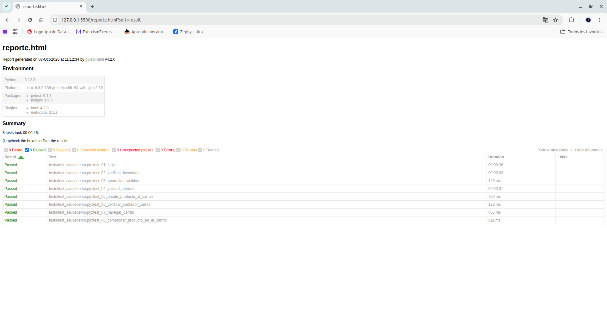

# pre-entrega-automation-testing--carlos-lopez-

# Pruebas automatizadas de SauceDemo

## Proposito

Este proyecto es una practica de Automation Testing. Las pruebas verifican el login, el inventario y el agregado de un producto al carrito en [SauceDemo](https://www.saucedemo.com).

## Tecnologi­as utilizadas

- Python
- Pytest
- Selenium
- WebDriver Manager
- Google Chrome

## Instalar las dependencias

Necesitas tener Python 3 y Google Chrome instalados. Desde la carpeta del proyecto, ejecuta estos comandos en Linux:

```bash
python3 -m venv venv
source venv/bin/activate
python -m pip install pytest selenium webdriver-manager
```

## Ejecutar las pruebas

Con el entorno virtual activo y desde la raiz del proyecto, ejecuta¡:

```bash
pytest
```

Se abrira Chrome y se ejecutara¡n las 8 pruebas. Al finalizar, el navegador se cerrara¡ y los resultados apareceran en la terminal.


## Reporte de pruebas

Al ejecutar `pytest`, se genera el archivo `reporte.html` con los resultados de las pruebas. En la ejecución mostrada, las 8 pruebas pasaron correctamente.

